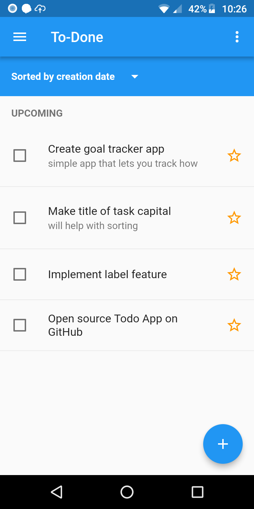
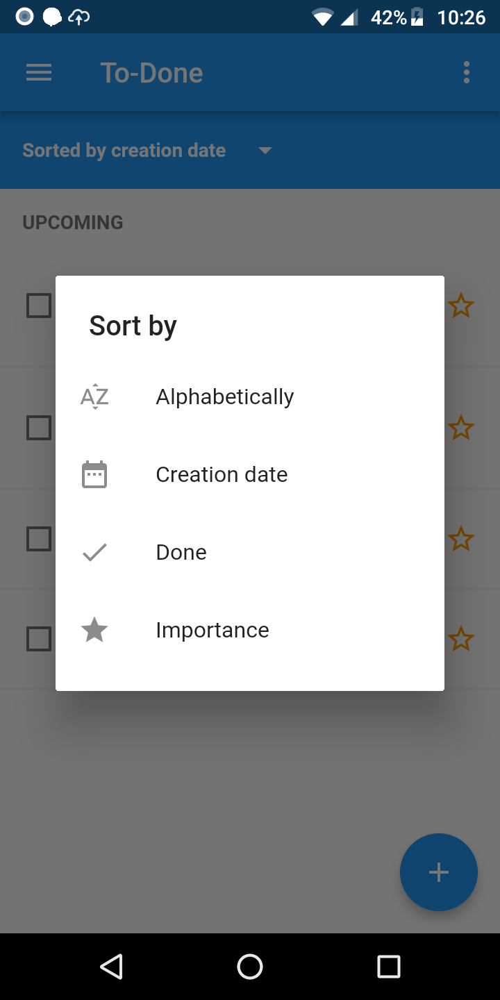
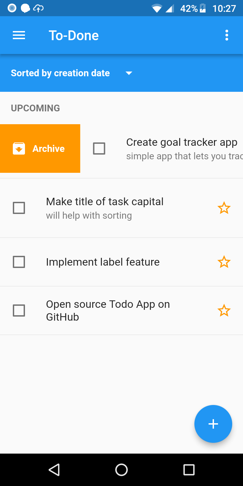
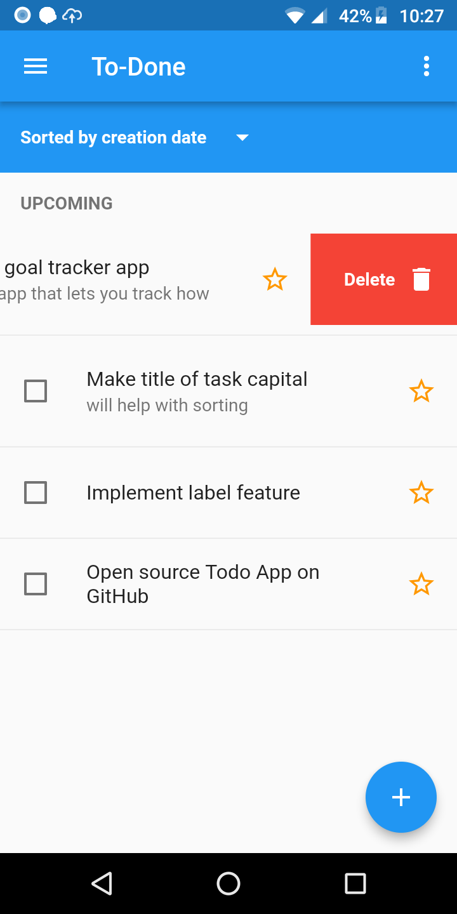
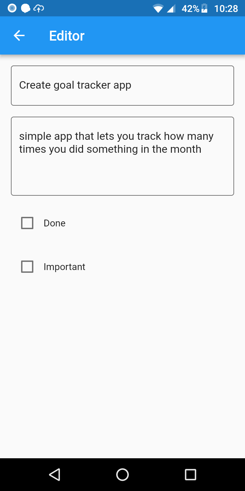
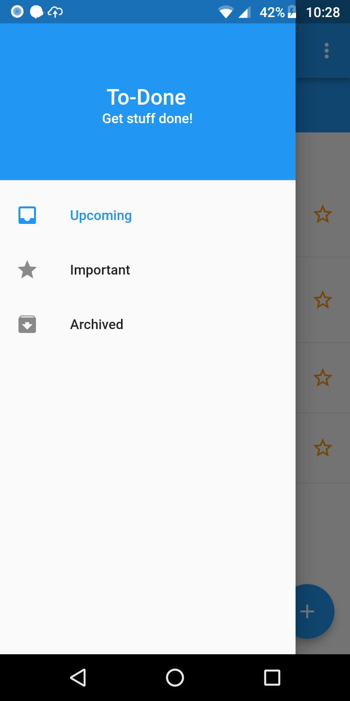

# todo_list

To-Do List App for iOS and Android built with Flutter

## Features
- Data is stored in a local SQLite database
- Uses material design for consistent UI across platforms
- Tasks can be marked as important, archived or deleted
- Swipe actions to archive a task or delete it

## Screenshots

## Roadmap
- [x] Implement CRUD of tasks with persistence using SQLite
- [ ] Refactor app to use the BLOC pattern
- [ ] Implement online sync with Firebase

For help getting started with Flutter, view our 
[online documentation](https://flutter.io/docs), which offers tutorials, 
samples, guidance on mobile development, and a full API reference.
